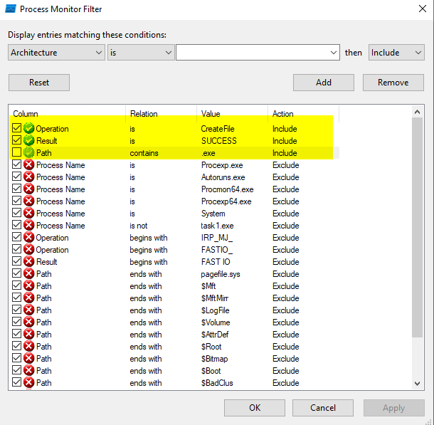
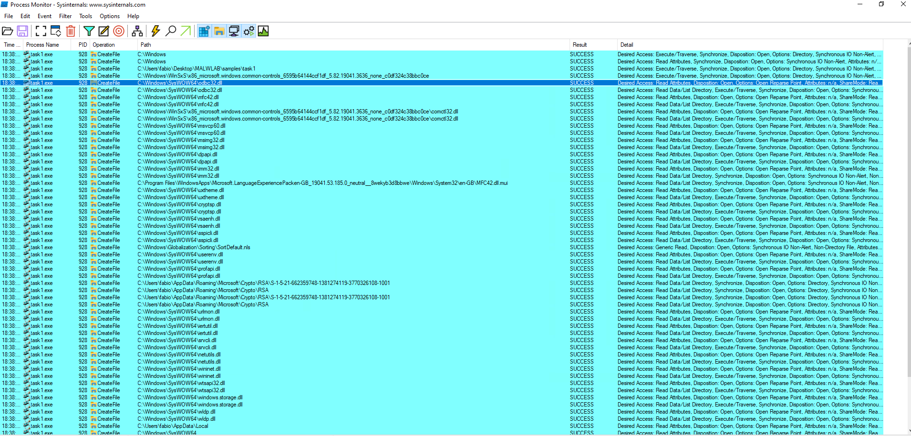
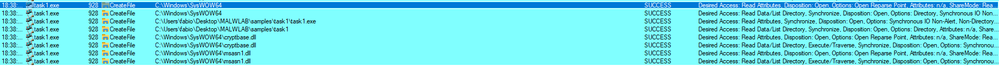
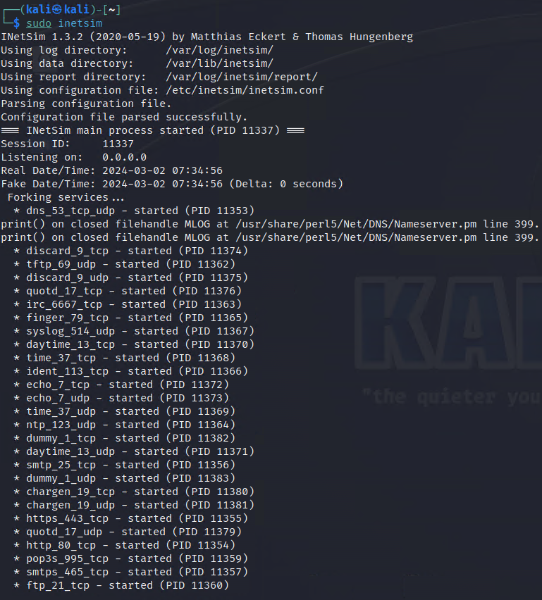
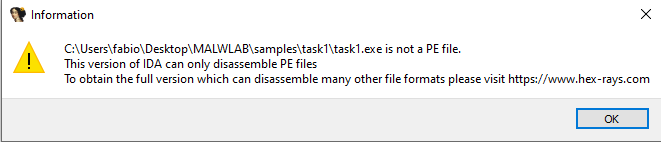

# MALWLAB - Task 1
## Formalities
- Authors: *Fabio Schmidt*, *Jonas Eggenberg*
- Date: *28.02.2024*
- Due Date: *13.03.2024*

## Table of Contents
1. [Initial Analysis](#init_analysis)
2. [Static Analysis](#static_analysis)
3. [Dynamic Analysis](#dynamic_analysis)
4. [References](#references)
<br>

//to remove in the end
-	Questions to Guide the Analysis
When has the sample initially been found in the wild?
In which time period was it (mainly) active?
The sample drops another file. Which file and where?
Which possible functionalities does the dropped file provide?
What servers are contacted? In which time period were they active?


## Initial Analysis <a name="init_analysis"></a>
### To be packed, or not to be packed?
#### Detect it Easy
Opening the malware via the program leads to the following graph:
<br>

<br>
As we can see, the third section (section(3), .rsrc section) has the highest entropy, peaking at 7.9. It always depends on the definition, at which height the entropy is considered to be "suspiscous". In our case, in accordance with the tutor, we consider a value around ~8 to be "interesting".
The lack of irregularities and the obviously named status "packed" furthermore underline this assumption.


#### PeStudio
The section sizes can be useful in detecting packed executables. For
example, if the Virtual Size is much larger than the Size of Raw Data, you
know that the section takes up more space in memory than it does on disk.
This is often indicative of packed code, particularly if the .text section is
larger in memory than on disk.
To note is the fact, that in Windows it is completely normal, that the .data section may be larger in memory (Virtual Size) than on Disk (Raw Size) 

| section | section[0] | section[1] | section[2] | section[3] |
|---|---|---|---|---|
| name | .text | .rdata | .data | .rsrc |
| raw-size (188416 bytes) | 0x00013000 (77824 bytes) | 0x00006000 (24576 bytes) | 0x00001000 (4096 bytes) | 0x00014000 (81920 bytes) |
| virtual-size (184380 bytes) | 0x0001296E (76142 bytes) | 0x00005316 (21270 bytes) | 0x00001F50 (8016 bytes) | 0x00013468 (78952 bytes) |

In the case of this sample, the differences in size between raw and virtual does not seem to convey the impression, that the file is packed (in contrast to the results of Detect it Easy). 

### Strings
Some but not all of the interesting strings, that were found are listed here. Thousands of strings were found.

<br>
!Restore the window to normal size<br>
version.dll<br>
GetCursorPos<br>
GetDesktopWindow<br>
GetPixel<br>
...
<br>


## Dynamic Analsis <a name="dynamic_analysis"></a>
After having gathered some initial information, it is not a bad idea to try to run the malware, to get an initial idea on how the malware operates.  

### RegShot
Taking a Registry Shot before and after the malware has been run results in the following discrepancies. Some parts were ommited due to the sheer size. The original file has been added in the task1 folder. 

```C
[...]
Keys added: 2
----------------------------------
HKU\S-1-5-21-662359748-1381274119-3770326108-1001\SOFTWARE\Microsoft\Windows\CurrentVersion\Explorer\SessionInfo\1\ApplicationViewManagement\W32:000000000006050E
HKU\S-1-5-21-662359748-1381274119-3770326108-1001\SOFTWARE\Microsoft\Windows\CurrentVersion\Explorer\SessionInfo\1\ApplicationViewManagement\W32:00000000000A030A
[...]
Values added: 27
----------------------------------
HKU\.DEFAULT\Software\Classes\Local Settings\MuiCache\c\417C44EB\@C:\Windows\system32\notepad.exe,-469: "Text Document"

[...]
----------------------------------
Values modified: 33
----------------------------------
[...]
```


### ProcessMonitor
To better monitor the malware process, the program "Process Monitor" is run simultaneously besides the sample. Some filters are set, such that we can more easly spot some important entries in procmon. Since the malware should spawn a file, we opted for the following filters:
<br>

<br>

*Procmon Results:*
<br><br>
(continuation)
<br><br>

In our test run, no interesting files where generated by the sample. It is to be noted, that multiple tests with different filter settings have been taken different machines and operating systems (Windows 10, 7 and XP).


### Networking 
In the following passage, we will try to find out, to which services the malware tries to connect to.

#### INetSim
We set up an internal network in the range of 192.168.100.0/24 and assigned the IP 192.168.100.100 to the infected Windows 10 VM and 192.168.100.101 to the Kali VM running INetSim. We also changed the DNS-server of the Windows 10 VM with the IP of the interceptor (kali VM). Both files `/etc/network/interfaces` and `/etc/inetsim/inetsim.conf` have been modified in the kali machine, by adding the following lines:

*/etc/network/interfaces*
```
auto [INTERFACE NAME]
iface [INTERFACE NAME] inet static
address 192.168.100.101
netmask 255.255.255.0
```

*/etc/inetsim/inetsim.conf*
```
Under the section **# service_bind_address** add `service_bind_address 192.168.100.101` (the IP of my kali VM). "0.0.0.0" should also work.

Under the section **# dns_default_ip** add `dns_default_ip 192.168.100.101` (the IP of my kali VM).
```

With this approach we hope to intercept the traffic of the infected machine, such that we can determine the connections which the malware tries to make.

Running INetSim with `sudo inetsim`
<br>

<br>
As seen in the screenshot, we are specifically targetting the protocols such as https, ftp etc.

Let's try to run the malware and see, if the kali VM picks up anything.
The logs are created after terminating the INetSim session. They can be found at `/var/log/inetsim/report/report.XXXX.txt`.
Unfortunately, since no report has been created, the malware did not try to establish connections via these protocols.
No luck this time.

#### Wireshark


## Static Analysis <a name="static_analysis"></a>
### Entry Point

Base Address: *00400000*

Entry point: *00412496*

### Imports
#### IDA64
*task1.exe*
No luck with IDA 64, since we got the following notification.
<br><br>

#### Ghidra
*task1.exe*
Looking at the packed malware will result in much of the data being unrecognized by Ghidra.

```C
       1000:00c3 00               ??         00h
       1000:00c4 00               ??         00h
       1000:00c5 00               ??         00h
       1000:00c6 00               ??         00h
       1000:00c7 00               ??         00h
       1000:00c8 00               ??         00h
       1000:00c9 00               ??         00h
       1000:00ca 00               ??         00h
```


### Exports


### Disassembly
#### IDA64


## References <a name="references"></a>
- Practical Malware Analysis: The Hands-On Guide to Dissecting Malicious Software - by Michael Sikorski & Andrew Honig (also some explanatory passages where cited from the book unaltered)

