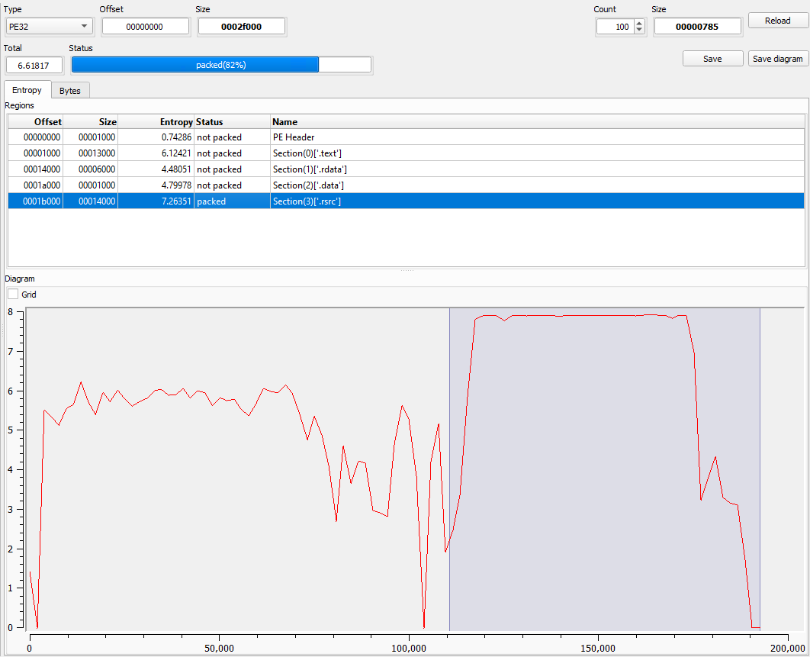

# MALWLAB - Task 1
## Formalities
- Authors: *Fabio Schmidt*, *Jonas Eggenberg*
- Date: *28.02.2024*
- Due Date: *13.03.2024*

## Table of Contents
1. [Initial Analysis](#init_analysis)
2. [Static Analysis](#static_analysis)
3. [Dynamic Analysis](#dynamic_analysis)
4. [References](#references)
 

## Initial Analysis 
### To be packed, or not to be packed?
#### Detect it Easy
Opening the malware via the program leads to the following graph:
 

 
As we can see, the third section (section(3), .rsrc section) has the highest entropy, peaking at 7.9. It always depends on the definition, at which height the entropy is considered to be "suspiscous". In our case, in accordance with the tutor, we consider a value around ~8 to be "interesting".
The lack of irregularities and the obviously named status "packed" furthermore underline this assumption.

#### PeStudio
The section sizes can be useful in detecting packed executables. For
example, if the Virtual Size is much larger than the Size of Raw Data, you
know that the section takes up more space in memory than it does on disk.
This is often indicative of packed code, particularly if the .text section is
larger in memory than on disk.
To note is the fact, that in Windows it is completely normal, that the .data section may be larger in memory (Virtual Size) than on Disk (Raw Size) 

| section | section[0] | section[1] | section[2] | section[3] |
|---|---|---|---|---|
| name | .text | .rdata | .data | .rsrc |
| raw-size (188416 bytes) | 0x00013000 (77824 bytes) | 0x00006000 (24576 bytes) | 0x00001000 (4096 bytes) | 0x00014000 (81920 bytes) |
| virtual-size (184380 bytes) | 0x0001296E (76142 bytes) | 0x00005316 (21270 bytes) | 0x00001F50 (8016 bytes) | 0x00013468 (78952 bytes) |

In the case of this sample, the differences in size between raw and virtual does not seem to convey the impression, that the file is packed (in contrast to the results of Detect it Easy). 

### Strings
Some but not all of the interesting strings, that were found are listed here. Thousands of strings were found (the real number is ommited, since both PeStudio and DIE presented us with different numbers).

 
!Restore the window to normal size 
version.dll 

 

### Unpacking with UPX

## Static Analysis 

### Imports
#### IDA64

### Exports
#### IDA64

### Disassembly
#### IDA64

## Dynamic Analsis 

## References 
- Practical Malware Analysis: The Hands-On Guide to Dissecting Malicious Software - by Michael Sikorski & Andrew Honig (also some explanatory passages where cited from the book unaltered)

