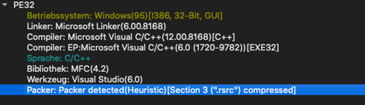
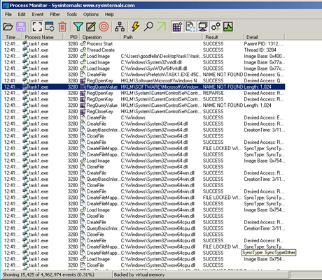
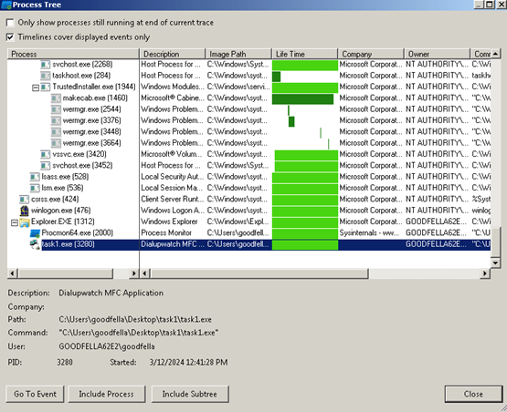
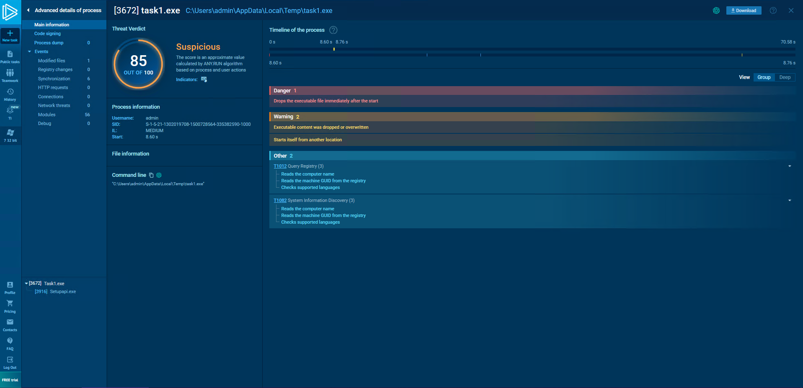
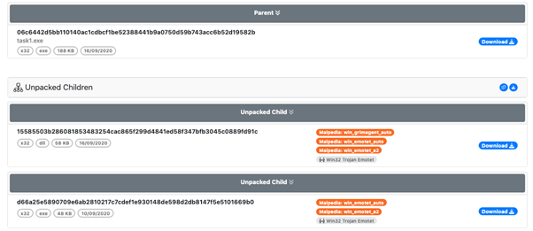
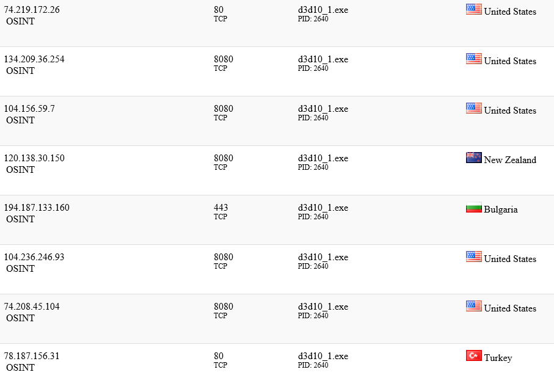
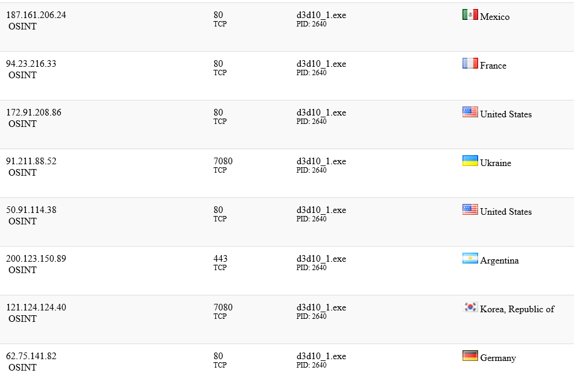
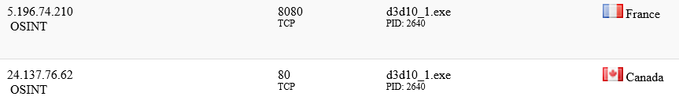
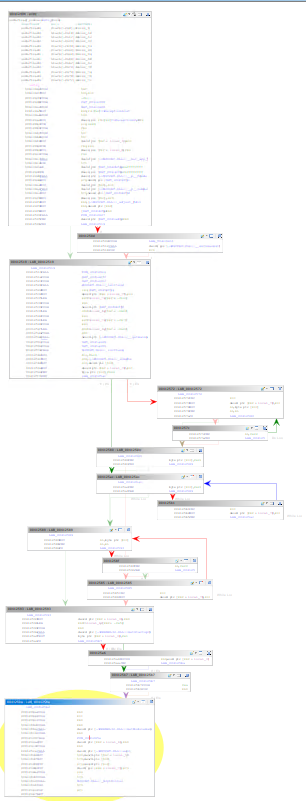
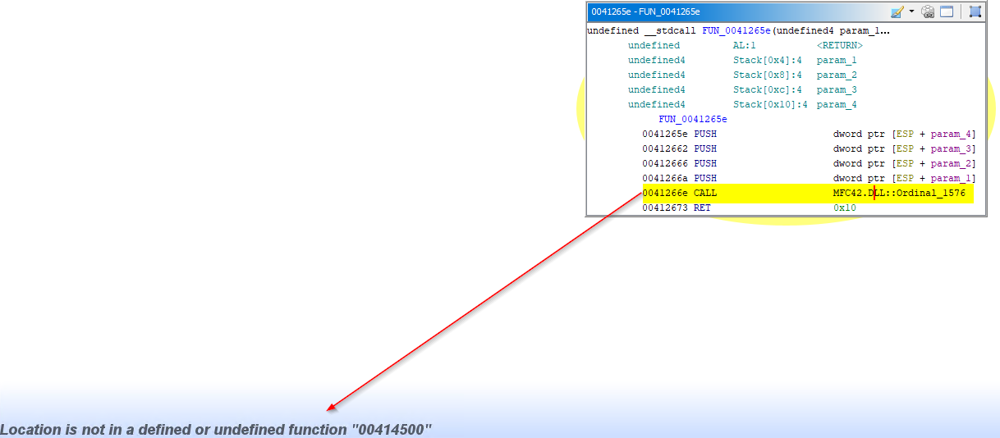

# MALWLAB - Task 1
## Formalities
- Authors: *Fabio Schmidt*, *Jonas Eggenberg*
- Tutor: *Dr. Tim Blazytko*
- Date: *28.02.2024*
- Due Date: *13.03.2024*

## Introduction
This write-up contains an analysis of the task1.exe file of the first MALWLAB assignment. The following questions were used (not exclusively) as a guide line throughout this text.

*Questions to Guide the Analysis*<br>
* When has the sample initially been found in the wild?
* In which time period was it (mainly) active?
* The sample drops another file. Which file and where?
* Which possible functionalities does the dropped file provide?
* What servers are contacted? In which time period were they active?

Furthermore a table of contents was added to provide some clarity between all the chapter and to quickly jump from one to another.

## Table of Contents
1. [Initial Analysis](#init_analysis)
2. [Dynamic Analysis](#dynamic_analysis)
3. [Static Analysis](#static_analysis)
4. [Summary](#summary)
5. [References](#references)
<br>

## Initial Analysis <a name="init_analysis"></a>
The following chapter will present an initial analysis, separated from the static and dynamic analysis presented in direct succession. This chapter consists primarely of information gathering, which is used as basis for the following chapters.

### Important Timestamps

#### Virus Total
* Category: *Trojan*
* Creation Time: *2020-09-16 10:57:03 UTC*
* First Seen In The Wild: *2023-03-05 01:16:27 UTC*
* First Submission: *2020-09-16 11:29:11 UTC*
* Last Submission: *2024-03-11 20:14:27 UTC*

#### Detect It Easy
DiE presents us with the following summary screen.
<br><br>
Compiler Stamp: 2020-09-16 12:57:03

### To be packed, or not to be packed?
#### Detect it Easy
Opening the malware via the program leads to the following graph:
<br>

<br>
As we can see, the third section (section(3), .rsrc section) has the highest entropy, peaking at 7.9. It always depends on the definition, at which height the entropy is considered to be "suspiscous". In our case, in accordance with the tutor, we consider a value around ~8 to be "interesting".
The lack of irregularities and the obviously named status "packed" furthermore underline this assumption.

#### PeStudio
The section sizes can be useful in detecting packed executables. For example, if the Virtual Size is much larger than the Size of Raw Data, you know that the section takes up more space in memory than it does on disk.
This is often indicative of packed code, particularly if the .text section is larger in memory than on disk.
To note is the fact, that in Windows it is completely normal, that the .data section may be larger in memory (Virtual Size) than on Disk (Raw Size) 

| section | section[0] | section[1] | section[2] | section[3] |
|---|---|---|---|---|
| name | .text | .rdata | .data | .rsrc |
| raw-size (188416 bytes) | 0x00013000 (77824 bytes) | 0x00006000 (24576 bytes) | 0x00001000 (4096 bytes) | 0x00014000 (81920 bytes) |
| virtual-size (184380 bytes) | 0x0001296E (76142 bytes) | 0x00005316 (21270 bytes) | 0x00001F50 (8016 bytes) | 0x00013468 (78952 bytes) |

In the case of this sample, the differences in size between raw and virtual does not seem to convey the impression, that the file is packed (in contrast to the results of Detect it Easy). 

### Strings
Some but not all of the interesting strings, that were found are listed here. Thousands of strings were found.

Listed are the API-functions of task1.exe, which are most likely to be found in combination with malware samples.
* Persistence
    * RegOpenKeyEx
    * RegSetValueEx
    * CopyFile
    * CreateFile
    * OpenSCManager
* Encryption
    * CryptAcquireContext
* Anti VM
    * GetVersion - sometimes used for VM detection
* Keylogging
    * SetWindowsHookEx
    * LoadLibrary
    * GetProcAddress
    * GetDC - used for taking screenshots
    * GetCursorPos
    * BitBlt - used for taking screenshots
    * FindResource - access resources of the executable
    * LoadResource - access resources of the executable
    * LockResource - access resources of the executable

When analysing the unpacked children, I also found the function *CreateToolhelp32Snapshot*.

## Dynamic Analysis <a name="dynamic_analysis"></a>
After having gathered some initial information, it is not a bad idea to try to run the malware, to get an initial idea on how the malware operates.  

### RegShot
Taking a Registry Shot before and after the malware has been run results in the following discrepancies. Some parts were ommited due to the sheer size. The original file has been added in the task1 folder. 

```C
[...]
Keys added: 2
----------------------------------
HKU\S-1-5-21-662359748-1381274119-3770326108-1001\SOFTWARE\Microsoft\Windows\CurrentVersion\Explorer\SessionInfo\1\ApplicationViewManagement\W32:000000000006050E
HKU\S-1-5-21-662359748-1381274119-3770326108-1001\SOFTWARE\Microsoft\Windows\CurrentVersion\Explorer\SessionInfo\1\ApplicationViewManagement\W32:00000000000A030A
[...]
Values added: 27
----------------------------------
HKU\.DEFAULT\Software\Classes\Local Settings\MuiCache\c\417C44EB\@C:\Windows\system32\notepad.exe,-469: "Text Document"

[...]
----------------------------------
Values modified: 33
----------------------------------
[...]
```


### ProcessMonitor
#### Operations of the Malware
<br><br>
* **Load Image**: This operation indicates that the malware is loading an executable or DLL into memory. Malware often loads additional modules or libraries to extend its functionality or to execute certain operations.
* **Create File**: The malware might be creating new files on the system. These files could be used for various purposes such as storing configuration data, logs, or payloads. Malware often creates files to persist on the system or to store stolen information.
* **RegOpenKey, RegQueryValue, RegCloseKey**: These operations involve interacting with the Windows Registry. Malware often uses the registry for persistence, configuration, or to store keys related to its operation. RegOpenKey is used to open a registry key, RegQueryValue is used to query a value within that key, and RegCloseKey is used to close the handle to the registry key once the operation is complete.
* **Close File**: This operation indicates that the malware has finished its interaction with a file and is closing it. It could be after reading from or writing to the file.
* **CreateFileMapping**: This operation creates a file mapping object in memory, which can be used to share data between processes or to map a file into memory. Malware might use this for various purposes such as inter-process communication, code injection, or to map files into memory for analysis or manipulation.

#### Finding the Children
Some filters are set, such that we can more easly spot some important entries in procmon. Since the malware should spawn a file, we opted for the following filters:
<br>

<br>

*Procmon Results:*
<br><br>
(continuation)
<br><br>

<br><br>

In our test run, no interesting files where generated by the sample. It is to be noted, that multiple tests with different filter settings have been taken different machines and operating systems (Windows 10, 7 and XP).
Some malware employs anti-analysis techniques to evade detection and hinder analysis. One common technique is to delay or avoid creating child processes until a certain condition is met. This could be a specific time, system event, or user interaction.

#### Cuckoo
The signature data found by the tool:
* PEiD Signatures - Armadillo v1.71
* screenshot - Take screenshot
* win_registry - Affect system registries
* win_files_operation - Affect private profile
* win_hook - Affect hook table

#### AnyRun
Since running the malware in a VM did not result in any file propagation, a second analysis has been taken with the online tool "AnyRun". After selecting Windows 7 (32-bit) as our test environment, the analysis resulted with the following data.

* The file has been classified as maliscious with a score of 85/100.
* A new file has been created at the location `C:\Users\admin\AppData\Local\certCredProvider\setupapi.exe`.
<br><br>

* It is confirmed, that task1.exe drops a file by looking at it's summary. Furthermore, no network activity has been found (at least not directly from task1.exe)
    *   
<br><br>
       

#### Unpac.me
Since the unpacking wasn’t visible with Process Monitor, we used unpack.me to do it for us.
Following Informations were found: 
* Execution
    * Shared Modules T1129 
    * access PEB ldr_data
    * get kernel32 base address
    * parse PE header
    * link function at runtime on Windows
    * get ntdll base address
* Defense Evasion
    * Obfuscated Files or Information T1027 
    * encode data using XOR
    * encrypt data using RC4 PRGA

There are 2 children that were unpacked.
<br><br>

### Networking 
In the following passage, we will try to find out, to which services (if any) the malware tries to connect to.

#### INetSim
We set up an internal network in the range of 192.168.100.0/24 and assigned the IP 192.168.100.100 to the infected Windows 10 VM and 192.168.100.101 to the Kali VM running INetSim. We also changed the DNS-server of the Windows 10 VM with the IP of the interceptor (kali VM). Both files `/etc/network/interfaces` and `/etc/inetsim/inetsim.conf` have been modified in the kali machine, by adding the following lines:

*/etc/network/interfaces*
```
auto [INTERFACE NAME]
iface [INTERFACE NAME] inet static
address 192.168.100.101
netmask 255.255.255.0
```

*/etc/inetsim/inetsim.conf*
```
Under the section **# service_bind_address** add `service_bind_address 192.168.100.101` (the IP of my kali VM). "0.0.0.0" should also work.

Under the section **# dns_default_ip** add `dns_default_ip 192.168.100.101` (the IP of my kali VM).
```

With this approach we hope to intercept the traffic of the infected machine, such that we can determine the connections which the malware tries to make.

Running INetSim with `sudo inetsim`
<br>

<br>
As seen in the screenshot, we are specifically targetting the protocols such as https, ftp etc.

Let's try to run the malware and see, if the kali VM picks up anything.
The logs are created after terminating the INetSim session. They can be found at `/var/log/inetsim/report/report.XXXX.txt`.
Unfortunately, since no report has been created, the malware did not try to establish connections via these protocols.
No luck this time.

#### Wireshark
A thorough write-up of this paragraph has been ommited, since no network activity has been found by Wireshark.

#### HybridAnalysis (Web-Sandbox)
<br><br>
<br><br>
<br><br>

## Static Analysis <a name="static_analysis"></a>
This chapter provides an attempt of our analysis of the task1.exe file and it's propagated setupapi.exe file. It is to be noted, that a deeper static analysis has been approached with IDA and Ghidra on the task1.exe file, but due to it being packed and due to time constraints, not much has been found out.

### Imports
*task1.exe*
* Registry Manipulation via ADVAPI32.dll: *RegCreateKeyA*, *RegSetValueExA*, *RegOpenKeyA*
* Mouse Movements and Monitor States via USER32.dll: *GetCursorPos*m *GetPixel*


*setupapi.exe*
* none, due to the lack of the executable


### Exports
*task1.exe*
* only one export with the unusual name *SDASQFddefgshdSSSgfdtEghfllTDFSSSSS*

*setupapi.exe*
* none, due to the lack of the executable

### Ghidra
Both task1.exe and setupapi.exe have been analyze with IDA and Ghidra. Unfortunately IDA refused to open both of the files, stating they would contain "maliscious behavior". We instead opted for Ghidra and tried to find out as much as possible with the code and time given.
Not everything has been brought to paper, since for example task1.exe was packed and the resulting analysis fell out short.
It is also to be stated that the files task1.exe and the task1.bin files were checked upon. The latter has been provided by the previously mentioned file AnyRun, since we could not retrieve the actual setupapi.exe file via VM.

*task1.exe*<br>
Packed to some degree. Write-up is ommited, since no useful information has been found out.

*task1.bin*<br>
From our understanding, this binary contains the unpacked variant of the original file. In such a case, we should see process, on how the setupapi.exe file is created and placed into the directory.
<br><br>
Unfortunately, just like before, not much information could be gathered. On one hand due to the lack of knowledge from our part and on the other hand because of some missing references in the code.  
<br><br>

*Disclaimer*
Due to the fact, that we only managed to unpack the malware in a last step, there was no time left for the analysis of the children.

## Summary <a name="summary"></a>
With the foundings at hand, we could establish a basic idea of the malwares operational scope. It seems to be a trojan with keylogging functionalities. We assume that since the malware wasn't unpacked, no DNS requests to a C&C server were attempted.
This exercise deepended our knowledge with the named tools, which can then be reused in further exercises.

## References <a name="references"></a>
- Practical Malware Analysis: The Hands-On Guide to Dissecting Malicious Software - by Michael Sikorski & Andrew Honig (also some explanatory passages where cited from the book unaltered)
- Online Sandboxing Tool AnyRun - https://any.run/
- Hybrid Analysis - https://www.hybrid-analysis.com/
- Cuckoo - https://cuckoo.cert.ee/
- UnpacMe - https://www.unpac.me/
- Wireshark Tutorial on LinkedIn - https://www.linkedin.com/advice/0/how-do-you-use-wireshark-analyze-malware-network
- Analyzing malware samples with ProcMon - https://www.youtube.com/watch?v=GpUIcYbOigg&t=353