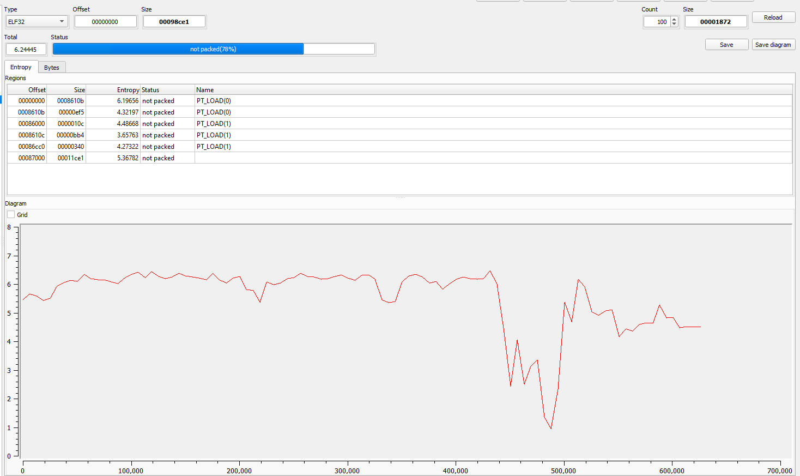
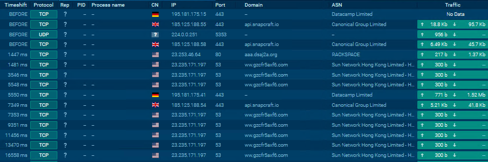

# MALWLAB - Task 2
## Formalities
- Authors: *Fabio Schmidt*, *Jonas Eggenberg*
- Tutor: *Dr. Tim Blazytko*
- Date: **
- Due Date: **

## Introduction
This write-up contains an analysis of the task2.exe file of the second MALWLAB assignment. The following questions were used (not exclusively) as a guide line throughout this text.

*Questions to Guide the Analysis*<br>
* Which functionality/features does the malware support? Keep it high level.
* How does the sample gain persistence?
* Locate the code for C&C command dispatching. What are the individual commands?
* What’s the encryption/decryption key for C&C server communication?
* Some strings in the sample are encrypted. Where and how are they decrypted?
* Decrypt some of the strings. What are they used for?
* What’s the purpose of the function CheckLKM?

Furthermore a table of contents was added to provide some clarity between all the chapters and to quickly jump from one to another.

## Table of Contents
1. [Initial Analysis](#init_analysis)
2. [Dynamic Analysis](#dynamic_analysis)
3. [Static Analysis](#static_analysis)
4. [Summary](#summary)
5. [References](#references)
<br>

## Initial Analysis <a name="init_analysis"></a>
The following chapter will present an initial analysis, separated from the static and dynamic analysis presented in direct succession. This chapter consists primarily of information gathering, which is used as basis for the following chapters.

### Important Timestamps

#### Virus Total
* SHA-256: *c0b0225201fd3a4c08245e58bbb4b844e0d3426e89b9ac3fc34db37d994fb182*
* Community Score: *45/64*
* Category: *Trojan*
* Creation Time: - 
* First Seen In The Wild: -
* First Submission: *2022-03-18 15:03:03 UTC*
* Last Submission: *2024-03-14 20:49:19 UTC*
* Dropped Files: *None*

#### Detect It Easy
DiE presents us with the following initial informations.
* ELF32
    * Operation system: Red Hat Linux(ABI:2.6.9)[386,32-bit,EXEC]
    * Compiler: GCC(4.1.2 20080704 (Red Hat 4.1.2-46))
    * Language: C/C++

### To be packed, or not to be packed?
#### Detect it Easy
Opening the malware via the program leads to the following graph:
<br>

<br>
Detect it Easy already states with a rather high percentual probability, that the binary is not packed. By looking at the graph and the section, we can see rather low entropy values and as such validate this assumption. As defined in the previous task (see the writeup of task1.exe) a value of greater or equal to seven should hint to a packed program. 

### Strings
Some but not all of the interesting strings, that were found are listed here. Thousands of strings were found.

Listed are the API-functions of task1.exe, which are most likely to be found in combination with malware samples.
* Persistence
    * RegOpenKeyEx
    * RegSetValueEx
    * CopyFile
    * CreateFile
    * OpenSCManager
* Encryption
    * CryptAcquireContext
* Anti VM
    * GetVersion - sometimes used for VM detection
* Keylogging
    * SetWindowsHookEx
    * LoadLibrary
    * GetProcAddress
    * GetDC - used for taking screenshots
    * GetCursorPos
    * BitBlt - used for taking screenshots
    * FindResource - access resources of the executable
    * LoadResource - access resources of the executable
    * LockResource - access resources of the executable

## Dynamic Analysis <a name="dynamic_analysis"></a>
After having gathered some initial information, it is not a bad idea to try to run the malware, to get an initial idea on how the malware operates.  

#### Cuckoo


#### AnyRun

* Category: *Sinkhole*, *Trojan*
* HTTP Requests:
    * GET | 404: Not Found - http://aaa.dsaj2a.org/config.rar
* Connections:
    * Multiple Connections to different locations (approximately 28)
    * The malware connects to locations like **Germany**, the **United Kingdom** and by a vast majority to the **United States**. 
    * Examples:
        <br><br>
* DNS Requests:
    * Around 154 requests (including duplicates)
    * Not all connections were successfull / responded
    * Approximately a quarter have been correctly marked as maliscious.
        * Examples:
            ```
            aaa.dsaj2a.org
            ww.gzcfr5axf6.com (multiple times)
            ww.gzcfr5axf7.com (multiple times)            
            ```
* Threats:
    * Extract:
        ```
        AV TROJAN DDoS.XOR sharing XOR Key Checkin
        ET MALWARE DDoS.XOR Checkin
        ET MALWARE DDoS.XOR Checkin via HTTP
        ```
    * "XOR.DDOS" was named after its denial-of-service-related activities on Linux endpoints and servers as well as its usage of XOR-based encryption for its communications.

* Process Graph (appended as pdf):
    * Looking at the graph will present us with a detailed view of all the processes which are somewhat in relation to the malware. Not all of them are relevant, but some can give us an insight of the functionalities of the malware. 
    * First, the trojan tries SSH brute force on thousands of Linux machines at the same time from the already compromised machine, and once it gains an initial foothold. It will download the malicious ELF file using curl and it takes careful measures before and after saving the file, leaving no traces for forensics.


* Processes:

Most notably about 


### Networking 
In the following passage, we will try to find out, to which services (if any) the malware tries to connect to.

#### INetSim
We set up an internal network in the range of 192.168.100.0/24 and assigned the IP 192.168.100.100 to the infected Windows 10 VM and 192.168.100.101 to the Kali VM running INetSim. We also changed the DNS-server of the Windows 10 VM with the IP of the interceptor (kali VM). Both files `/etc/network/interfaces` and `/etc/inetsim/inetsim.conf` have been modified in the kali machine, by adding the following lines:

*/etc/network/interfaces*
```
auto [INTERFACE NAME]
iface [INTERFACE NAME] inet static
address 192.168.100.101
netmask 255.255.255.0
```

*/etc/inetsim/inetsim.conf*
```
Under the section **# service_bind_address** add `service_bind_address 192.168.100.101` (the IP of my kali VM). "0.0.0.0" should also work.

Under the section **# dns_default_ip** add `dns_default_ip 192.168.100.101` (the IP of my kali VM).
```

With this approach we hope to intercept the traffic of the infected machine, such that we can determine the connections which the malware tries to make.

Running INetSim with `sudo inetsim`
<br>

<br>
As seen in the screenshot, we are specifically targetting the protocols such as https, ftp etc.

Let's try to run the malware and see, if the kali VM picks up anything.
The logs are created after terminating the INetSim session. They can be found at `/var/log/inetsim/report/report.XXXX.txt`.
Unfortunately, since no report has been created, the malware did not try to establish connections via these protocols.
No luck this time.

#### Wireshark


## Static Analysis <a name="static_analysis"></a>
This chapter provides an attempt of

### Imports


### Exports


### Ghidra

### IDA


### Binary Ninja


## Summary <a name="summary"></a>
With the foundings at hand, we could establish a basic idea of the malwares operational scope. It seems to be a trojan with keylogging functionalities. We assume that since the malware wasn't unpacked, no DNS requests to a C&C server were attempted.
This exercise deepended our knowledge with the named tools, which can then be reused in further exercises.

## References <a name="references"></a>
- Practical Malware Analysis: The Hands-On Guide to Dissecting Malicious Software - by Michael Sikorski & Andrew Honig (also some explanatory passages where cited from the book unaltered)
- Online Sandboxing Tool AnyRun - https://any.run/
- Hybrid Analysis - https://www.hybrid-analysis.com/
- Cuckoo - https://cuckoo.cert.ee/
- Wireshark Tutorial on LinkedIn - https://www.linkedin.com/advice/0/how-do-you-use-wireshark-analyze-malware-network
- How to Detect Raising New XORDDOS Linux Trojan - https://www.socinvestigation.com/how-to-detect-raising-new-xorddos-linux-trojan/